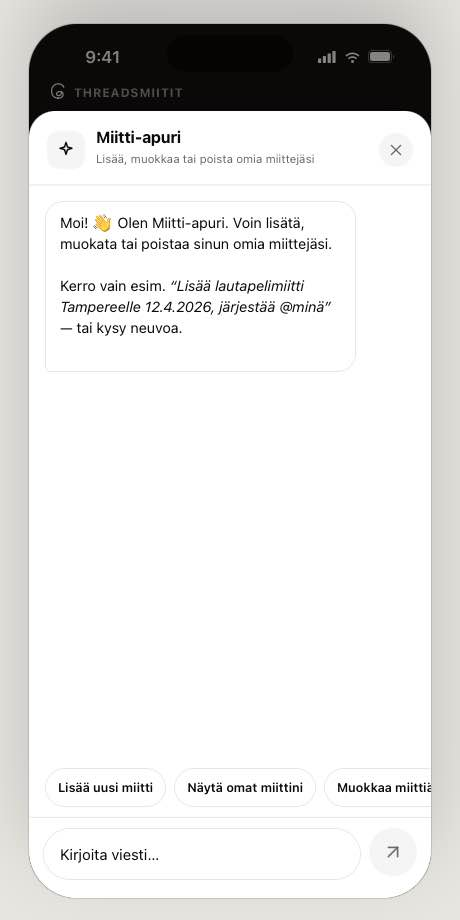

# Threadsmiitit

Finnish community meetup calendar — aggregates Threads-posted meetups across Finnish cities into one read-only calendar that links back to the original posts for sign-up. Volunteer-run, all UI copy in Finnish.

**Live:** https://threadsmiitit.netlify.app/

## Screenshots

| Home (monodark) | Detail sheet | Chat assistant |
|---|---|---|
|  |  |  |

| Warm palette | Bold vibe |
|---|---|
|  |  |

## Features

- **Miitit** — filterable list with a "this week" highlight rail and group-by (date / city)
- **Kalenteri** — month grid with colour-coded category dots and selected-day detail
- **Lisää miitti** — 4-step guided form for adding your own meetup
- **Info** — sub-pages: how to organise, Karaoke challenge 2026, city directory, past meetups
- **Miitti-apuri** — AI chat assistant (Finnish) powered by Anthropic; add / edit / remove your meetups conversationally

### Data source

The seed meetup and city list in `src/data.js` is manually transcribed from the community listing at [sites.google.com/view/threadsmiitit](https://sites.google.com/view/threadsmiitit) and from individual Threads posts (linked per-entry). It is refreshed periodically by a maintainer — see the file's header comment and git history for details. Meetups added by users through the app are submitted to a shared server-side store (`EventStore` → `/api/events*` Netlify Functions → Netlify Blobs) and only reach the public feed once an admin approves them.

## Development

### Prerequisites

- Node.js ≥ 22.12.0 (`.nvmrc` provided; `nvm use` to activate)

### Install

```bash
npm ci
```

### Run

```bash
npm run dev
```

Opens http://localhost:8001.

#### AI assistant

To enable the Miitti-apuri chat assistant, set your Anthropic API key in the shell before starting the dev server:

```bash
$env:ANTHROPIC_API_KEY = "sk-ant-..."    # PowerShell
export ANTHROPIC_API_KEY="sk-ant-..."    # bash/zsh
npm run dev
```

The key is read **server-side** only — never exposed in the browser bundle. In production, the Netlify Function at `netlify/functions/chat.js` handles the route and enforces:

- **Origin check** — only requests from the deployed site's origin are accepted (set `ALLOWED_ORIGIN` in Netlify environment variables; defaults to `https://threadsmiitit.netlify.app`).
- **Body validation** — prompt must be a non-empty string ≤ 4 000 characters.
- **Rate limiting** — 30 requests per 60 s per IP via Netlify edge rules (requires Netlify Pro or higher; configured in `netlify.toml`).

#### Threads OAuth (optional)

The `netlify/functions/auth-*.js` functions implement Threads (Meta) OAuth login. A successful login mints a signed, httpOnly `tm_session` cookie (see `netlify/functions/lib/session.mjs`); the client learns who is signed in via `GET /api/auth/whoami`, never by reading the cookie itself. See [.env.example](.env.example) for the full list of environment variables (`THREADS_CLIENT_ID`, `THREADS_CLIENT_SECRET`, `THREADS_REDIRECT_URI`, `SESSION_SECRET`, `ALLOWED_ORIGIN`) needed to enable it locally.

#### Error monitoring (optional)

Set `VITE_SENTRY_DSN` (browser) and/or `SENTRY_DSN` (Netlify Functions) to report uncaught errors to [Sentry](https://sentry.io). Both are unset by default — the app and functions run exactly as before with no external calls. See `src/lib/sentry.js` and `netlify/functions/lib/sentry.mjs`.

##### Sentry triage automation

`.github/workflows/sentry-triage.yml` runs `.github/scripts/sentry-triage.mjs` daily (and on demand via `workflow_dispatch`). It lists every unresolved Sentry issue and:

- **Resolves it automatically** if the title matches a pattern in [sentry-triage.config.json](sentry-triage.config.json) — for known noise like a deliberately-thrown smoke-test error, no code change is needed.
- **Lists it in a single tracking GitHub issue** (label `sentry-triage`, kept up to date rather than duplicated per run) otherwise. The script never writes a fix itself — pick an item from that issue, branch and fix it through the normal [PR workflow](CLAUDE.md#pr-workflow--mandatory-for-every-code-change), then resolve the Sentry issue by hand once the fix has shipped.

Requires the `SENTRY_AUTH_TOKEN` secret (an internal integration token with Issues: Read & Write) and `SENTRY_ORG`/`SENTRY_PROJECT` repository variables. Run it locally with `npm run sentry:triage` (needs those same values plus `GITHUB_TOKEN` — e.g. `export GITHUB_TOKEN=$(gh auth token)`); see [.env.example](.env.example).

### Build

```bash
npm run build
```

Compiles React + SCSS via Vite into `dist/`.

### Lint & format

```bash
npm run lint
npm run format
```

### Test

```bash
npm test
```

Runs unit tests and one end-to-end test on Node's built-in test runner. The end-to-end test (`test/e2e.mjs`) renders the app in a simulated DOM ([happy-dom](https://github.com/capricorn86/happy-dom)) via [@testing-library/react](https://testing-library.com/docs/react-testing-library/intro/), loading JSX through Vite's own SSR module loader — no extra build step, but it does pull in a few dev-only dependencies beyond the unit tests.

## Tech stack

| Layer | Choice |
|---|---|
| UI | React 18 + inline style props (no CSS-in-JS lib) |
| Build | Vite 8 + `@vitejs/plugin-react` |
| Styles | SCSS via sass (global resets only; components use inline styles) |
| AI | Anthropic Messages API via Netlify Function (`/api/chat`) in production; Vite dev middleware locally |
| Deploy | Netlify (SPA redirect + Netlify Functions v2) |
| Storage | Netlify Blobs via EventStore + `/api/events*` Netlify Functions (favourites and custom cities stay in localStorage) |
| Lint | ESLint + Prettier + Stylelint + commitlint |
| Tests | Node built-in `node:test` |

## Generated documentation

`npm run docs` generates HTML API docs from JSDoc comments into `docs/` (gitignored, disposable — regenerate any time). `.github/workflows/docs.yml` publishes this to GitHub Pages on every push to `main`.

> **One-time setup:** GitHub Pages must be enabled for this to take effect — repo **Settings → Pages → Build and deployment → Source: GitHub Actions**.

## Contributing

See [CONTRIBUTING.md](CONTRIBUTING.md).

## Changelog

See [CHANGELOG.md](CHANGELOG.md).

## Citation

See [CITATION.cff](CITATION.cff) for how to cite this project.

## License

MIT — see [LICENSE](LICENSE). Covers both code and documentation in this repository.
